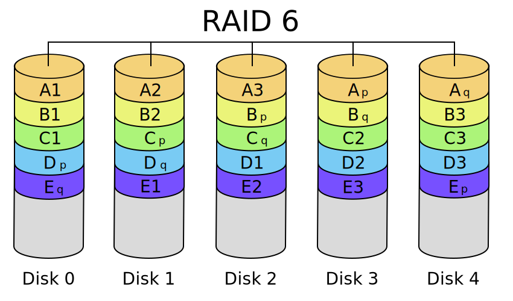
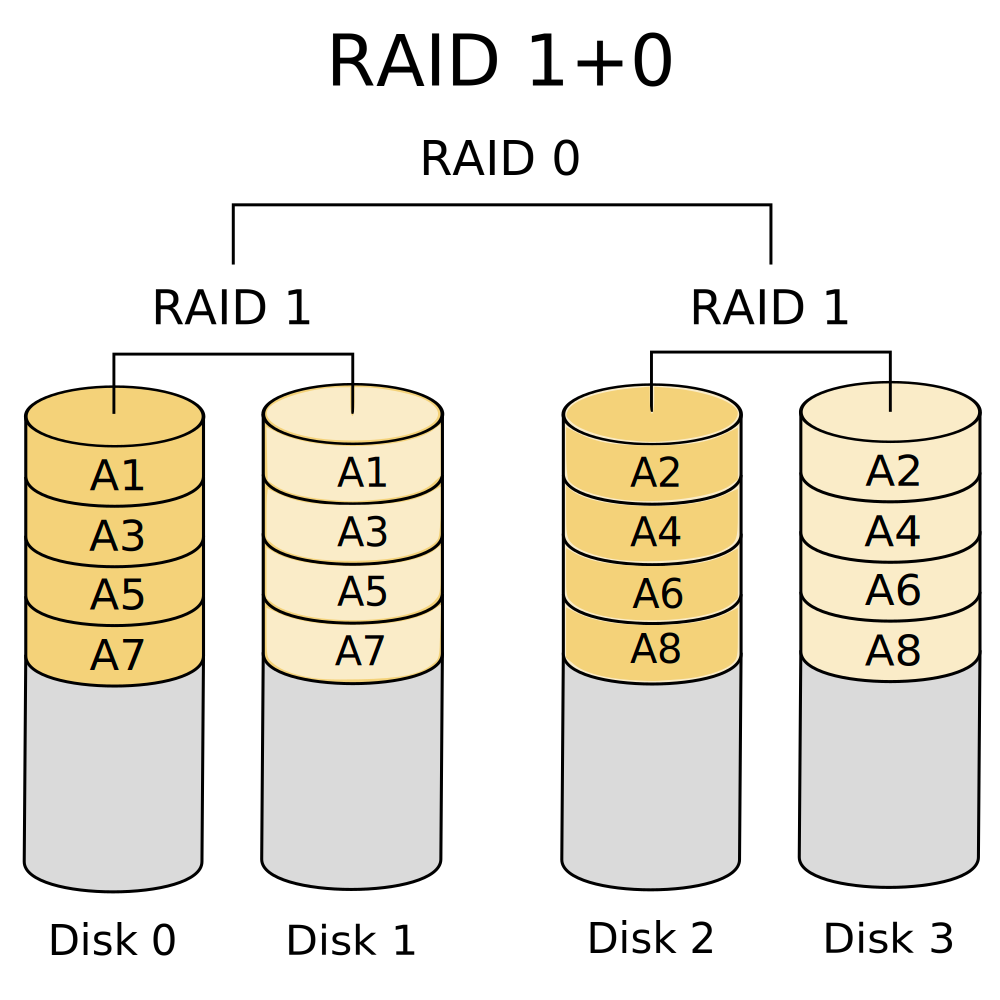

RAID
====

Redundant Array of Inexpensive Disks (RAID) is where a number of
identical standard drives are used in multiple. Depending on the
configuration used, this can increase capacity, performance and
reliability.

RAID levels

:   are standard patterns in which RAID is implemented, .

RAID set

:   is a number of physical disks that has been combined using a RAID
    level. A RAID set can be:

    Healthy:

    :   where all of its member disks are working.

    Degraded:

    :   where one or more of its member disks have failed while the
        others continue to work. I/O operations can continue.

    Failed:

    :   where one or more of its member disks have failed such that I/O
        operations cannot continue.

Metrics
=======

Fault tolerence
---------------

Each RAID level can tolerate a number of disks failing.

Storage efficiency
------------------

The storage efficiency of a RAID set is:

	E = ( useable capacity ) / ( sum of RAID set disks capacity )

For any given RAID set, it depends on the RAID level, `L`, in use and
the number of disks, `n`.

Write penalty
-------------

Most RAID levels have a write penalty, which is the number of write
operations that occur compared to when a single disk is used. A single
disk would have a write penalty of 1.

Basic RAID levels
=================

The two basic RAID levels involve striping and mirroring. Assume that
some data has been split up into equally sized chunks labelled `A1, A2$`
etc. Let `n` be the number of disks in the set.

RAID-0 (Stripe)
---------------

RAID-0 splits, or stripes, data across a minimum of $2$ disks, .

### RAID-0 fault tolerence

RAID-0 has no fault tolerence. If any one disk fails no I/O can be
performed. If the failure is permanent, data is permanently lost.

Using standard redundancy notation, RAID-0 has redundancy `N`.

### RAID-0 storage efficiency

In RAID-0, data is striped across all disks in the set.
The space of all the `n` disks in the set is usable.

	RAID-0 efficiency = n / n = 1

### RAID-0 write penalty

RAID-0 does not incur additional writes, so its write penalty is 1.

RAID-1 (Mirror)
---------------

RAID-1 mirrors, or copies, data across `n` disks:

-   RAID-1 is commonly implemented with 2 disks, but RAID-1 sets can
    have any number of disks.

-   Read performance theoretically `n` times single disk.

-   Write performance is identical to a single disk in theory.

### RAID-1 fault tolerence

RAID-1 maintains full data integrity with only a single disk remaining
functional:

-   RAID-1 disk is identical to a single non-RAID disk.

In redundancy terms, RAID-1 is `N+(n-1)` redundant.

### RAID-1 storage efficiency

In RAID-1, data is mirrored onto all disks in the set. So only 1 disk’s
worth of capacity in the set of `n` is useable, giving:

	Efficiency(L=1, n) = 1 / n 

### RAID-1 write penalty

RAID-1 incurs a write for each disk in the set, so its write penalty is
`n`. Most RAID-1 sets have two disks, so this is often 2.

Parity-based RAID
=================

Parity relies on the XOR operation:

    A     B    C = A XOR B $
  ----- ----- -------------------
    0     0   0
    0     1   1
    1     0   1
    1     1   0

The parity blocks are computed bitwise from the data blocks using XOR.

RAID-4
------

RAID-4 stripes data blocks across `n-1` disks where the remaining 1
disk is used for parity. A minimum of 3 disks is required for RAID-4.

Bit-by-bit the parity computation for a single stripe, in this case `A` is:
  A_p & = A_1 \oplus A_2 \oplus A_3\end{aligned}$$ The same parity
computation is used for stripes $B$, $C$, $D$.

RAID-5
------

RAID-5 is conceptually similar to RAID-4. Parity is computed for each
stripe in the same way, but is stored differently. Instead of a single
parity disk, the parity blocks are distributed amongst all disks.

### RAID-5 fault tolerence

-   RAID-5 is tolerent of failure of one disk. The array can continue to
    operate in degraded mode with no data loss and I/O
    operations available.

-   When the failed disk is replaced, a rebuild occurs onto the new disk
    by XORing the corresponding blocks on the remaining disks.

-   The array is vulnerable while degraded. If a second disk failure
    occurs, data will be lost.

In redundancy terms, RAID-5 is `N+1` redundant.

### RAID-5 storage efficiency

For RAID-5, the parity data takes up the capacity of one disk (although
distributed across them all). THe parity data does not contribute to the
storage available for use. This means that of the `n` disks in the set,
only the capacity equivalent to `n-1` disks is available for use:

	Efficiency(L=5, n)  =  ( n - 1 ) / n  =  1 - 1 / n 

RAID-6
------

RAID-6 is similar to RAID-5 but adds a second parity block in each
stripe.

### RAID-6 fault tolerence

The second parity block in each stripe means that RAID-6 can sustain the
loss of up to two disks in a set while still remaining operational:

-   Rebuild proceeds in the same way as RAID-5 except there are two
    parity blocks.

In redundancy terms, RAID-6 is `N+2` redundant.

### RAID-6 storage efficiency

In RAID-6 we lose the equivalent of two disks’ space to store the parity
information.

	Efficiency(L=6, n)  =  ( n - 2 ) / n  =  1 - 2 / n 

Nested RAID
===========

RAID-01
-------

RAID-10
-------

Implementation
==============

RAID can be implemented in either software or hardware:

Hardware-based

:   RAID is where the Host Bus Adapter (HBA) implements the
    RAID functionality. The host and its OS sees the single block device
    resulting from the RAID implementation.

Software-based

:   RAID is where the RAID functionality is implemented within the host,
    usually as part of the operating system. The HBA just passes through
    each physical disk as a block device.

Hybrid

:   RAID is sometimes used for nested RAID configurations. Disks are
    combined into RAID sets by one or more HBAs and the exported block
    devices are then grouped into RAID set(s) in software.

Hardware-assisted

:   RAID is a mix of hardware and software RAID. The XOR computations
    are accelerated by a chip in the HBA while the rest of the RAID
    implementation is done in software. Seen in some motherboard-based
    RAID controllers and often best avoided!

Despite a lot of ill-informed comment online and elsewhere, it is almost
impossible to definitively say whether software or hardware-based RAID
is preferable. The choice depends on a large number of factors: devices,
HBA capabilities, HBA throughput, OS, filesystem(s) to be used,
portability requirements.

Monitoring
==========

**Problem:** RAID set becomes degraded due to disk failure. Essential
that the failed disk is replaced before a further failure occurs.

**Solution:** The RAID set must have appropriate monitoring installed.

-   Hardware RAID controllers often have a separate management
    capabilities, appearing as a separate device on the host system.
    This often needs proprietary software to work.

-   Software RAID setups more visible by default to the OS and will
    appear in system logs.

-   Either way, should be proactively sending notifications (e.g.
    e-mail, helpdesk API).

Hot spares
==========

If hardware / software capabilities and available drive bays allow, it
is possible to automatically replace a failed disk with a hot spare.

1.  The RAID controller / software detects the failed disk,
    sends notification.

2.  Controller removes it from the array (which is now degraded). The
    disk remains physically in its bay and plugged into the same port.

3.  The controller/software then adds the hot spare to the array.
    Re-build commences on to the hot spare.

4.  Array is then in a healthy state once rebuild has completed.

5.  Failed disk can be replaced on schedule on next physical visit.
    Re-built onto replaced disk, hot spare removed from array.

